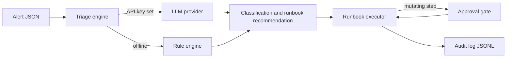

# sre-copilot

This is a public, cleaned-up release of a personal tool I built during my independent engineering period in 2025. It triages incoming alerts and executes runbooks with an approval gate and an audit trail. All names, hosts and runbooks in this repository are examples.

## What it does

- `sre-copilot triage <alert.json>` reads an alert, classifies it (category, likely cause, urgency) and recommends a runbook. Triage can use an LLM provider (OpenAI or Anthropic) when an API key is set. Without a key it uses a deterministic rule engine, so the tool works offline and gives the same answer every time.
- `sre-copilot runbook list` shows the runbooks found on disk.
- `sre-copilot runbook run <name> --alert <alert.json>` executes a runbook step by step. Steps are shell commands, HTTP checks, waits or verify commands. Any step marked `mutating: true` needs approval before it runs. Pass `--yes` to auto-approve, or `--dry-run` to see what would happen without executing anything.
- `sre-copilot history` prints the audit log as a table. Every step outcome is written to `./audit/audit.jsonl` with a UTC timestamp, the result and who approved any mutating step.

## Why

Triage is repetitive. Most alerts fall into a small set of shapes, and the first ten minutes of an incident are usually spent working out which shape this one is. This tool does that first pass and points at the matching runbook, while keeping a written record of every action so the incident review has facts rather than memory.

## Quickstart

Works offline. No API keys needed.

```bash
git clone https://github.com/mindfulcto-labs/sre-copilot.git
cd sre-copilot
python3 -m venv .venv && source .venv/bin/activate
pip install -e .

# Classify an example alert
sre-copilot triage examples/alerts/disk-full.json

# See the shipped runbooks
sre-copilot runbook list

# Walk through a runbook without executing anything
sre-copilot runbook run disk-pressure --alert examples/alerts/disk-full.json --dry-run

# See the audit trail the dry run left behind
sre-copilot history
```

To run a runbook for real, drop `--dry-run`. You will be asked to approve each mutating step, or you can pass `--yes`.

## Architecture



The rule engine is the floor, not a stub. It is deterministic, runs in tests and CI, and answers whenever a provider is missing or fails mid-call. Runbooks are plain YAML files with four step types: `command`, `http_check`, `wait` and `verify`. The executor stops at the first failed or declined step and writes every outcome to the audit log, including dry runs.

## Configuration

All configuration is through environment variables. None are required.

| Variable | Purpose |
| --- | --- |
| `OPENAI_API_KEY` | Enables the OpenAI triage provider. |
| `ANTHROPIC_API_KEY` | Enables the Anthropic triage provider. Wins when both keys are set. |
| `SRE_COPILOT_PROVIDER` | Force a choice: `openai`, `anthropic` or `rules`. |
| `SRE_COPILOT_MODEL` | Override the default model name for the chosen provider. |
| `SRE_COPILOT_RUNBOOK_DIRS` | Colon-separated runbook search path. Default: `./runbooks:./examples/runbooks`. |
| `SRE_COPILOT_AUDIT_DIR` | Where the audit log lives. Default: `./audit`. |
| `SRE_COPILOT_APPROVER` | Name recorded against approved steps. Default: the OS user name. |

Alert fields are passed to runbook commands as environment variables: `SRE_ALERT_SOURCE`, `SRE_ALERT_SEVERITY`, `SRE_ALERT_SERVICE` and `SRE_ALERT_MESSAGE`.

## Evals

A small harness replays 15 labelled alert fixtures through the rule engine and reports precision and recall per category. It runs offline and fails if overall accuracy drops below 0.8, so it doubles as a regression gate in CI.

```bash
python evals/run_evals.py
```

## Development

```bash
pip install -e ".[dev]"
ruff check .
pytest
```

## Status

Status: v0.1.0, single-maintainer, reviewed releases. The LLM providers are optional and lightly exercised; the rule engine, executor and audit paths are covered by the test suite. Runbook commands run through the shell on the machine where you invoke the tool, so read a runbook before you run it.

## Licence

Apache-2.0. See [LICENSE](LICENSE).
